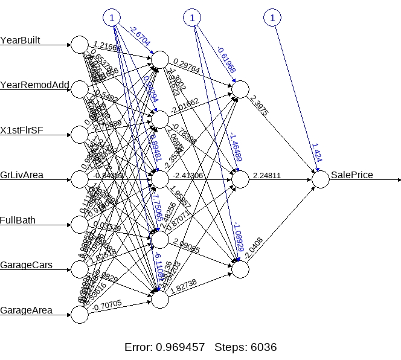

```{r setup, include=FALSE}
knitr::opts_chunk$set(echo = TRUE)
```


```{r echo=FALSE, out.width='100%'}

```


To view all the files in this project, please go to [My Github site](https://github.com/asmozo24/Machine_Learning_Final_Project).


```{r load-packages, results='hide',warning=FALSE, message=FALSE, echo=FALSE}

##library(tidyverse) #loading all library needed for this assignment


library(knitr)
library(dplyr)
library(tidyr)

library(stats)
library(statsr)
library(GGally)
library(pdftools)
library(correlation)
library(naniar)

library(urca)
library(tsibble)
library(tseries)
library(forecast)
library(caret)
set.seed(8032)
library(plyr)
library(arules)
library(arulesViz)
library(report)
library(cluster) # to perform different types of hierarchical clustering
# package functions used: daisy(), diana(), clusplot()
#install.packages("visdat")
library(visdat)
library(plotly)
library(reshape2)
library(mlbench)
library(corrplot)
library(pROC)
library(prodlim)

library(DataExplorer)
library(MASS)


```


\newpage


\centering
\raggedright
\newpage
\tableofcontents
\newpage


### Summary

 
Let’s say someone is interested in buying a house and don't know how to prepare for it. Imagine this person who is looking for a dream home and don't even know where to start. Buying a house start with knowing the sale price. If this person who is wondering about buying house and has no clue, then there is a problem. Buying a house is a lifetime experience for many first-time home buyers. It is an exciting moment, but it can be a bad one if things turn out unexpectedly. Thus, the question is: how can a home buyer know about the sale price of a house? Meaning, how to predict a sale price of a house? Well! Machine learning has the answer to this question. Machine learning algorithm is a computer algorithm that teaches itself a pattern based on data. In other words, machine learning builds a pattern that helps identify the future event occurring. 

When we said machine learning is a computer algorithm to build a pattern for a sale price of a house that is not fully correct. It is not correct because there are many algorithms, and the pattern relies heavily on the data. If there is no data, then there is no price prediction. Therefore, data plays an important role in predicting the price of a something with the machine learning algorithm. The dataset used to predict the sale price of a house is from the Ames housing division in Iowa. The dataset is available at Kaggle.com. The data has about 1460 observations and 81 features with sale price (the target variable) included. These features describe just about everything that is part of a house. We are talking about the lot size, the year the house was built, the garage condition, fireplace conditions, etc. Although there are enough variables in this dataset, we still need to clean the data before fitting it to the model for analysis. The cleaning involved removing all unnecessary variables, the variables that have equivalent meaning with other variables or variables that have way more missing values by visual inspection. Finally, we used correlation technique to find which variable has strong influence on the target variable.

The purpose of cleaning the data is to ensure that we have the right data for the method used for the analysis. Let's recall that data analysis is the process of collecting, modeling, and analyzing data to extract meaningful information that ultimately leads to decision-making. In other words, the leadership want to make decisions based on solid facts. Building these solid facts is where the methodology comes to play. There are several methods and techniques use in analyzing the data. The choice of the method and technique will depend on the aspect of the data (quantitative or qualitative). This Ames Housing data has quantitative aspect because it has finite number (discrete data) of values resulted from measurements collected on each house individually. For example, the number of bedrooms in the house, the number of car garage attached to the house and the size of the lot. Although some values are qualitative such as the condition of the garage (excellent, good, fair and none), it still refers to quantitative data. These data are taken as quantitative because this is not a survey where the responses are not uniformed. It is measurable data with standard in place. This type of measurements requires expertise that would apply the standards and unformalized for all houses. Cleaning the data is a step that precedes the analysis. We used multiple linear regression and Neutral Network method to analyze the data. The technique used is basically fitting the data to the model. The model here refers to the computerized formulas for each machine learning algorithm.

 The purpose of performing the analysis is to predict the sale price of a house. Initially, we had a question about how one can predict the sale price of a house. Well! This is where the magic happens. The accuracy of predicting this price depends on the formulas. The choice of multiple linear regression is because while preparing the data for the analysis, we plotted few predictors against the target variable and saw some linear relationship. The second choice of neutral network is because we wanted to see how an unsupervised machine learning will perform against a supervised one. At the end, the verdict was tight because each algorithm performed well. Since the neutral network seems to be popular in neuron studies (complicated topic), we thought it would have easily outperformed the multiple linear regression. The assumption was not valid because this regression analysis showed better results with a low mean squared error value compared with the one from neutral network. In addition, based on the output values such as p-value, the chosen explanatory variables explained well the sale price of a house. Furthermore, we like the regression performance better because we can apply it into a business. Knowing a set of features along with the machine learning algorithm that can directly influence the sale price of a house, we can build an application that can tell customers the sale price of a house. We think this can be a starting point for many home buyers. There are other factors such as speculation (demand and supply) and inflation that influence the sale price of a house, but we believe the home buyers want to know this price first.


### Problem Statement

How can we predict the sale price of a house?

### Data Collection

#### Data source

We found some interesting dataset from data source: https://www.kaggle.com/competitions/house-prices-advanced-regression-techniques/data

This data was originally generated  the Ames Housing, a division within the Ames city in Iowa state. Thanks to Kaggle for making the data available free of use. The data is about a sale record of houses with all the defined criteria. Below is the description of the variable present in the dataset.

For a quicker look, we made the data (no modification) available at [My Github site](https://github.com/asmozo24/Machine_Learning_Final_Project/blob/main/train.csv)


#### Data Dictionary

```{r,  echo=FALSE}

# Loading our data
df1 <- read.csv("https://raw.githubusercontent.com/asmozo24/Machine_Learning_Final_Project/main/train.csv", stringsAsFactors = FALSE)

# load the text file which has the description of all the variable.
df_dictionary <- read.delim("https://raw.githubusercontent.com/asmozo24/Machine_Learning_Final_Project/main/data_description.txt", stringsAsFactors=FALSE)

df_dictionary

#View(df1)
#View(df_dictionary)

```


#### Data Overview/Charateristic

```{r, echo=FALSE}
#see variables
df1 %>%
  head()

#datatype
#missing values

vis_dat(df1)


```


  

 
This data is composed of 80 features for 1460 observations. The datatypes are mixed of integer and character. The target variable or the variable of interest is 'SalePrice'. According to the dictionary, 'SalePrice' is the price at which a house was sold. Other variables are criteria used to derive the price of the house. We believe 81 variables for a price determination is excessive. Not all these variable are relevant/pertinent to the target variable. In addition, some variables have missing values. Therefore, we will need to reduce the number of feature by pertinence to SalePrice and cleaning the missing values.

  

### Data Cleaning

  
Let's see the missing values.


```{r , echo=FALSE}
library(skimr)
library(lubridate)
library(visdat)

library(DataExplorer)

#skim(df1)
#skim_tee(df1)

df1 %>%
  skim() %>%
  dplyr::select(where(is.numeric)) %>%
  dplyr::top_n(10)


```

  
 

There are 43 character(categorical) variables and 38 numerical variables. We know there are 1460 observations, so seeing the number (or percent) missing values per variable can give us an idea of the cleaning approach.


```{r, echo=FALSE}
colSums(sapply(df1[,1:40], is.na)) %>%
  kable()

```

  

```{r, echo=FALSE}

plot_missing(df1[,1:40])


```

  
We selected half of the variables. Let's see the other half.


```{r, echo=FALSE}

colSums(sapply(df1[,41:81], is.na)) %>%
  kable()


#vis_miss(df1)
#gather(df1)
#vis_cor(df), need variables to be numerical

# To visualize if we expect to see some value
#vis_expect(df1, ~.x==" ")
#visualisation_recipe(df1)

#plotting missing values
plot_missing(df1[,41:81])

```

  
 
By visual inspection, we can remove these variables: PoolQC, Fence, Alley, MiscFeature, FireplaceQu, LotFrontage. because missing too many value...it probably means these variables are not important ... houses that have these variables with values are probably extra..extra...or too special...

LotFrontage = LotFrontage: Linear feet of street connected to property. We want to remove this variable due to the 17.4% missing values and the fact that every house is built under the city regulation.

We will remove variable 'Id'. There is no need for it or because it is just an indication for record purpose.


```{r, echo=FALSE}

df1_NA_cols <- sapply(df1, function(x) sum(is.na(x))) 
df1_NA_cols[df1_NA_cols>0] %>% kable()

```

  
 

Above are variables with missing values greater than 0. I like this already!

This is where the benefit of having friends who are in housing for sale or construction count.

Next, we will evaluate (does it really matter? can it be done easily? does it cost a lot ?) all other variables with missing values 

GarageFinish (81 missing values): Interior finish of the garage...average homebuyers don't care about it... the condition of the garage is sufficient ... remove

GarageQual (81 missing values): Garage quality, this might mean the quality of the materials used to build the garage. Remove...

GarageCond (81 missing values): Garage condition, this might mean the condition(look) at the time the house is sold. 

GarageType(81 missing values):  garage location......garage condition is enough ....remove 

GarageYrBlt(81 missing values): garage year built...same with yearbuilt...remove

MasVnrType(07 missing values): Masonry veneer type...the type of material used to construct the house(bricks, stone...)...we can keep it for now

MasVnrArea(07 missing values): Masonry veneer area in square feet...this is the kind of work homebuyers won't do. Because it involve doing the math to find the ratio of the veneer area covered Vs. not covered....remove

BsmtQual( 037 missing values): Evaluates the height of the basement...will be removed because another variable described the same thing.

BsmtCond (37 missing values): Evaluates the general condition of the basement....we can keep...

BsmtExposure(38 missing values): Refers to walkout or garden level walls..average homebuyers don't care about it. remove


BsmtFinType1 (37 missing values): Rating of basement finished area...described already...remove

BsmtFinType2 ( 38 missing values): Type 1 finished square feet...no tricky math for buyer... remove

Electrical...we will only remove the 01 missing values...no hurts 


  

```{r, echo=FALSE}

df2 <- subset( df1, select = -c(Id, LotFrontage, Alley,MasVnrArea,BsmtQual, BsmtExposure,BsmtFinType1 , BsmtFinType2,  FireplaceQu, GarageType,  GarageYrBlt, GarageFinish,GarageQual,  PoolQC,Fence,  MiscFeature ) )


names(df2)

```

  
 

Above list is the name of the remaining variables after we removed the first set as described early. We continue to remove by pertinence (if it seems like extra or one can live without it in the area...) to the sale price.

LandContour,LotShape, Street, LotConfig, LandSlope, Condition2, RoofStyle, Exterior2nd, OverallQual, Foundation, TotalBsmtSF,BsmtUnfSF, Heating, Electrical, X1stFlrSF, X2ndFlrSF, LowQualFinSF, BsmtFullBath, BsmtHalfBath, TotRmsAbvGrd, PavedDrive, EnclosedPorch, 3SsnPorch, ScreenPorch, MoSold,MSSubClass,Condition1 

  

```{r, echo=FALSE}

df3 <- subset( df2, select = -c(LandContour,LotShape,Street,Heating, Electrical, LotConfig, LandSlope, Condition2,RoofStyle, Exterior2nd, OverallQual, Foundation, TotalBsmtSF,BsmtUnfSF,LowQualFinSF, BsmtFullBath, BsmtHalfBath, TotRmsAbvGrd, PavedDrive, EnclosedPorch, ScreenPorch, MoSold,MSSubClass,Condition1, X2ndFlrSF, X3SsnPorch))
      
#df3 <-  subset(df3, select = -c() )

#`1stFlrSF`

#glimpse(df3)
#df2 %>%
#  select_if(is.numeric)
names(df3)

df1_NA_cols <- sapply(df3, function(x) sum(is.na(x))) 
df1_NA_cols[df1_NA_cols>0]


```

  
 

We significantly reduced the number of variable by nearly half. No need to do imputation by mean or other numerical imputations. We just need to replace the value according to the definition of the variable and remove the row where 'NA' has no meaning and it is very low missing values (ex: 10 missing values will no infere on 1460 observations)

  

```{r, echo=FALSE}

df3$BsmtCond     <- df3$BsmtCond  %>%
                                 replace_na('No Basement')

df3$GarageCond  <- df3$GarageCond %>% 
                      replace_na('No Garage')

#use is.na() method to delete row wit hNA
#df3 <- df3[!is.na(df3$MasVnrType),]
df3 <- subset(df3, !is.na(MasVnrType))
#df3 %>% drop_na(MasVnrType)

#df1_NA_cols <- sapply(df3, function(x) sum(is.na(x))) 
#df1_NA_cols[df1_NA_cols>0]

#str(df3)
names(df3)

```

  

Remained 36 variables after cleaning... let's convert character variables to categorical ones.

### Exploratory Data Analysis (EDA)

  

```{r, echo=FALSE}


library(psych) 

#create summary table
describe(df3) %>% kable()
#summary(df3)

```

  

```{r, echo=FALSE}

num_vars <- df3 %>%
  select_if(is.numeric)


ggplot(data = melt(num_vars), aes(x = value)) + 
stat_density() + 
facet_wrap(~variable, scales = "free")

```


  
 

Above is the distribution of numerical variables...yearsold looks like many years counted. in fact, those variables with multiple mode, mean the variable have a set of of values that repeat. Hard to see off values (outliers).

below is the distribution of categorical variables, not all them will be plot because some of them have too many levels to be plotted all at once...maybe there is another technique


  

```{r, echo=FALSE}

#categorical variables
cat_vars <- df3 %>%
  dplyr::select(-c("LotArea"  ,    "OverallCond" , "YearBuilt"   , "YearRemodAdd", "BsmtFinSF1" ,  "BsmtFinSF2" ,  "X1stFlrSF"    ,"GrLivArea"  ,  "FullBath"  ,   "HalfBath"    , "BedroomAbvGr" ,"KitchenAbvGr" ,"Fireplaces",   "GarageCars"  , "GarageArea"  ,"WoodDeckSF"   , "OpenPorchSF" , "PoolArea"  ,   "MiscVal"  ,    "YrSold"  ,     "SalePrice"   ))

ggplot(data = df3) +
  geom_bar(mapping = aes(x = MSZoning, fill=MSZoning))

#+coord_flip()

```


  


```{r, echo=FALSE}
  
ggplot(data = df3) +
  geom_bar(mapping = aes(x = SaleCondition, fill=SaleCondition))

```


  

```{r, echo=FALSE}
ggplot(data = df3) +
  geom_bar(mapping = aes(x = KitchenQual, fill= KitchenQual))

```

  

```{r, echo=FALSE}
ggplot(data = df3) +
  geom_bar(mapping = aes(x = SaleType, fill=SaleType))+coord_flip()

```


  

```{r, echo=FALSE}
ggplot(data = df3) +
  geom_bar(mapping = aes(x = CentralAir , fill=CentralAir))

```


  


```{r, echo=FALSE}
ggplot(data = df3) +
  geom_bar(mapping = aes(x = HouseStyle, fill=HouseStyle ))+ coord_flip()
```


  


```{r, echo=FALSE}
ggplot(data = df3) +
  geom_bar(mapping = aes(x = Utilities, fill=Utilities))

```


  


```{r,echo=FALSE}
ggplot(data = df3) +
  geom_bar(mapping = aes(x = BldgType, fill=BldgType))
names(df3)
# 
# ggplot(data = melt(cat_vars), aes(x = value)) + 
# stat_density() + 
# facet_wrap(~variable, scales = "free")

```

  
 

The way we visualize these categorical variables is that some of them can be redefined numerical since the categorical level in some of them are null or close to null. Potentially use some rating...
0  means nothing
1  means poor 
and so on with ...2, 3, 4, 5..

Of course this is not the only way to transform them...

  


### Feature Engineering

\vspace
Let's see the range in the variables years...
  

```{r , echo=FALSE}

cat("The earliest house was sold in ", min(df3$YrSold))

dfo <- structure(list(sale_price = df3$SalePrice[df3$YrSold==min(df3$YrSold)]), class = c("tbl_df", "tbl", "data.frame"), row.names = c(NA, -313L))

View(dfo)

dfo <-dfo %>%
  group_by(sale_price)%>%
  mutate(counts = n())

ggplot()+
  geom_bar( mapping= aes(df3$SalePrice[df3$YrSold==min(df3$YrSold)]), colour = "blue", size=1)+
  labs(title = "Houses Sold in 2006",
       x = "Sale Price",
       y = "Number of houses")
```

  

Another way of seeing the houses sold in 2006...

  

```{r, echo=FALSE}


ggplot(dfo) + 
  geom_point(aes(x = counts, y = sale_price, colour = sale_price), size = 3)+
  labs(title = "Houses Sold in 2006",
       x = "Number of houses",
       y = "Sale Price")

```

  

```{r, echo=FALSE}
ggplot(data = df3) +
  geom_bar(mapping = aes(x = BldgType, fill=BldgType))


```

  


let's see some values 

  

```{r, echo=FALSE}
cat("\n\nThe latest house was sold in ", max(df3$YrSold))

#table(df3$YearBuilt) %>%
#  kable()

cat("\n\nThe earliest house was built in ", min(df3$YearBuilt))
cat("\n\nThe latest house was built in ", max(df3$YearBuilt))
cat("\n\nThe house that was the first to be rebuilt was in ", min(df3$YearRemodAdd))
cat("\n\nThe house that was latest to be rebuilt was in ", max(df3$YearRemodAdd))
```
   
     
Let's see the distribution at which house were sold.
   
```{r, echo=FALSE}       
table (df3$YrSold) %>%
  kable()

```

  


Not sure what to  think of the variables with years...does it affect the target variable? Let's transform categorical to factor.

  


```{r, echo=FALSE}

#categorical variables
# cat_vars <- names(df3 %>%
#   dplyr::select(-c("LotArea"  ,    "OverallCond" , "YearBuilt"   , "YearRemodAdd", "BsmtFinSF1" ,  "BsmtFinSF2" ,  "X1stFlrSF"    ,"GrLivArea"  ,  "FullBath"  ,   "HalfBath"    , "BedroomAbvGr" ,"KitchenAbvGr" ,"Fireplaces",   "GarageCars"  , "GarageArea"  ,"WoodDeckSF"   , "OpenPorchSF" , "PoolArea"  ,   "MiscVal"  ,    "YrSold"  ,     "SalePrice"   )))

categorical_vars = c("MSZoning"  ,    "Utilities"  ,   "Neighborhood",  "BldgType" ,     "HouseStyle"   ,
 "RoofMatl"     , "Exterior1st"   ,"MasVnrType"  ,  "ExterQual"   ,  "ExterCond"  ,  
 "BsmtCond"  ,    "HeatingQC"   ,  "CentralAir" ,   "KitchenQual" ,  "Functional" ,  
 "SaleType"   ,   "SaleCondition")

# view values with year

a <- (df3[categorical_vars] <- lapply(df3[categorical_vars], factor))

df3%>%
  head()

```

  
Let's see some boxplot


```{r, echo=FALSE}
boxplot(num_vars$SalePrice)
boxplot(num_vars$YearRemodAdd)
boxplot(num_vars$GrLivArea)

```

  
As we can see, SalePrice, GrLivArea have some outliers...
For the sake that we want to run regression analysis, we limit the variables to numerical moving forward. 


Let's see some correlations

  

```{r, echo=FALSE}

#correlations <- cor(na.omit(df3[,-1, with = FALSE]))
correlation <- cor(num_vars)
#cor1 = cor(num_vars)
# correlations
index1 <- apply(correlation, 1, function(x) sum(x > 0.3 | x < -0.3) > 1)

correlation <- correlation[index1 ,index1 ]
corrplot(correlation, method="square")

# 
# df_cor = cor(cor1)
# # putt any value as a "cutoff" 
# high_cor = findCorrelation(df_cor, cutoff=0.7) 
# high_cor = sort(high_cor)
# 
# new_df = num_vars[,-c(high_cor)]
# names(new_df)

#write down the reduce variable
#write.csv(reduced_Data, file = "outfile.csv", row.names = FALSE)


```

  
 
Based on the correlation plot, if we want to select those with high correlation with the target variable. Let's run another correlation function to help us select these variables rather than relying on visual (nothing wrong with visual)...

  


```{r, echo=FALSE}


library(lares)
corr_var(num_vars, # name of dataset
  SalePrice, # name of variable to focus on
  top = 10 # display top 5 correlations
)

```


  
 
We will keep the variables with 0.5 above...
there are really 08 variables (                 )

Let's see SalesPrice Vs. GrLivArea 


  
 
```{r, echo=FALSE}

df4 <- num_vars %>%
     dplyr::select(c(YearBuilt, YearRemodAdd , X1stFlrSF     , GrLivArea  , FullBath, GarageCars,  GarageArea, SalePrice))

library(wesanderson)
# See all palettes
#names(wes_palettes)
colors1 <- wes_palette(10, name = "Darjeeling1", type = "continuous")

plot1 <- ggplot(data = df4, mapping = aes(x = GrLivArea, y = SalePrice, size = GarageArea, color = GarageCars))
plot1 + geom_point() + theme(text=element_text(size = 16)) +
ggtitle("GrLivArea vs SalePrice") + scale_color_gradientn(colors = colors1)+ 
geom_smooth(method = lm)


```


  
 
Let's see SalesPrice Vs. YearBuilt 


  
 
```{r, echo=FALSE}

plot1 <- ggplot(data = df4, mapping = aes(x = YearBuilt, y = SalePrice, size = GarageArea, color = GarageCars))
plot1 + geom_point() + theme(text=element_text(size = 16)) +
ggtitle("SalePrice Vs. YearBuilt") + scale_color_gradientn(colors = colors1)+ 
geom_smooth(method = lm)


```


  
 
Let's see SalesPrice Vs. YearRemodAdd  
 
 
  
 
```{r, echo=FALSE}
plot1 <- ggplot(data = df4, mapping = aes(x = YearRemodAdd, y = SalePrice, size = GarageArea, color = GarageCars))
plot1 + geom_point() + theme(text=element_text(size = 16)) +
ggtitle("SalePrice Vs. YearBuilt") + scale_color_gradientn(colors = colors1)+ 
geom_smooth(method = lm)


```


  

Definitely high correlation and linear relationship....


  

### Modelling


  
 
We will run multiple linear regression and Neutral Network. 
There are definitely regression variables in this dataset. the neutral network is to see how other algorithm will perform, specially those on the unsupervised category. Neutral network seem to have perfomance in neuron analysis (according to neuroscientists who performed them...)


  
 

#### Splitting the data

  
 
Split will be 0.8 train and 0.2 test


  
 
```{r, echo=FALSE}

index <- sample(1:nrow(df4),round(0.80*nrow(df4)))
train <- df4[index,]
test <- df4[-index,]

```


  
 

#### Multiple Linear Regression (model1)

  
 

We want to use glm() function due to more than one independent/predictors. 


  
 
```{r, echo=FALSE}

model1 <- glm(SalePrice~., data=train)
summary(model1)
predict_model1 <- predict(model1,test)
MSE_model1 <- sum((predict_model1 - test$SalePrice)^2)/nrow(test)
plot(model1$fitted.values)

```


  
 
Wow! All the variables show good significance to the SalePrice.


  
 
#### Neutral Network (model2)


  
 
```{r, echo=FALSE}


max <- apply(df4, 2, max) 
min <- apply(df4, 2, min)

scaled <- as.data.frame(scale(df4, center = min, scale = max - min))

trainNN <- scaled[index,]
testNN <- scaled[-index,]


# install library -->
#install.packages("neuralnet") -->

#install.packages("devtools") --> -->

#library(devtools) -->

#devtools::install_github("bips-hb/neuralnet") -->

# load library -->

library(neuralnet)

# because the formula y~.x is not welcome in the neuralnet() function. We need to build the formula differently, then we can pass it as an argument in the model function.
names1 <- names(trainNN)

formula <- as.formula(paste("SalePrice ~", paste(names1[!names1 %in% "SalePrice"], collapse = " + ")))
model2 <- neuralnet(formula,data=trainNN,hidden=c(5,3),linear.output=T)

plot(model2)

#names(train)

# Or We can try another way
#hidden argument takes a vector with the number of neurons for each hidden layer
# linear.output = F is choosing classification
model2a = neuralnet(SalePrice ~ YearBuilt + YearRemodAdd + GrLivArea + FullBath + GarageCars +GarageArea, trainNN, hidden = 3 , linear.output = T )

plot(model2a)


```




  
 
Well done!


predicting NN


  
 
```{r, echo=FALSE}
# Prediction using neural network -->
#names(testNN)


predictNN = neuralnet::compute(model2, testNN[,1:7])

predictNN = (predictNN$net.result*(max(df4$SalePrice)-min(df4$SalePrice)))+min(df4$SalePrice)

plot(testNN$SalePrice, predictNN, col='blue', pch=16, ylab = "predicted SalePrice NN", xlab = "Real SalePrice", main = "Predicted SalePrice NN Vs. Real Price")
abline(0,1, lwd=3)

test_r <- (testNN$SalePrice)*(max(df4$SalePrice)-min(df4$SalePrice))+min(df4$SalePrice)

MSE_model2 <- sum((test_r - predictNN)^2)/nrow(testNN)

#we compare MSE of model1 and model2

table(MSE_model1, MSE_model2)


par(mfrow=c(1,2))

plot(testNN$SalePrice,predictNN,col='red',main='Real SalesPrice vs Predicted SalePrice NN',pch=18,cex=0.7)
abline(0,1,lwd=2)
legend('bottomright',legend='NN',pch=18,col='red', bty='n')

plot(testNN$SalePrice,predict_model1,col='blue',main='Real SalePrice vs Predicted SalePrice regression',pch=18, cex=0.7)
abline(0,1,lwd=2)
legend('bottomright',legend='LM',pch=18,col='blue', bty='n', cex=.95)


```


  
 
Neutral Network seems about equal performance with  multiple linear regression.

A closer look


  
 
```{r, echo=FALSE}

plot(testNN$SalePrice,predictNN,col='red',main='Real SalePrice vs Predicted NN',pch=18,cex=0.7)
points(testNN$SalePrice,predict_model1,col='blue',pch=18,cex=0.7)
abline(0,1,lwd=2)
legend('bottomright',legend=c('NN','LM'),pch=18,col=c('red','blue'))

```


  
 
It is a hard call here...but we want to go with Multiple linear regression since it has a better MSE and p-value.


### References

1 - file:///C:/Users/owner/Downloads/622-Article%20Text-961-2-10-20220308.pdf

2 - http://neuralnetworksanddeeplearning.com/chap1.html

3- https://cran.r-project.org/web/packages/dlookr/vignettes/EDA.html

4- https://stats.oarc.ucla.edu/stat/data/rmarkdown/rmarkdown_seminar_flat.html#links-internal-and-external

5- https://plotly.com/r/line-charts/

6- https://www.r-bloggers.com/2015/09/fitting-a-neural-network-in-r-neuralnet-package/


